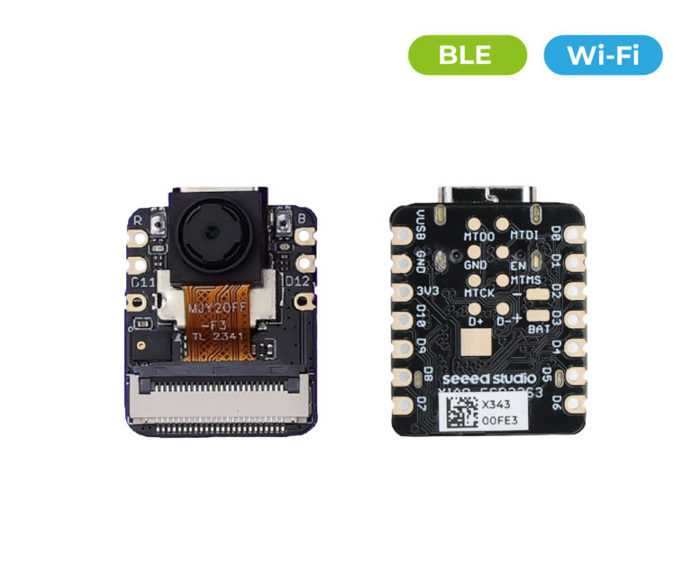
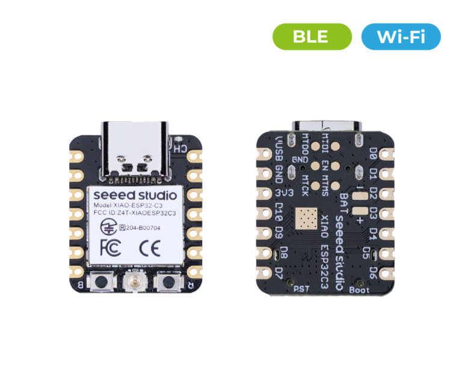
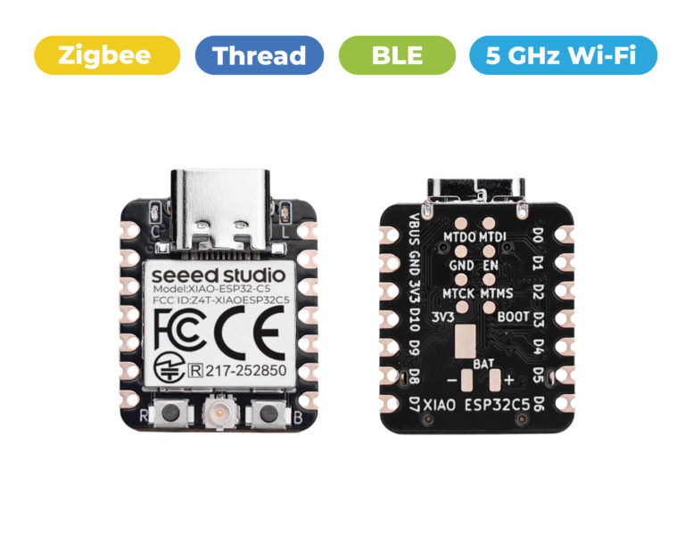
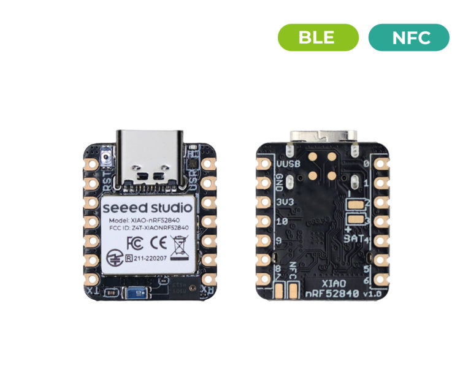
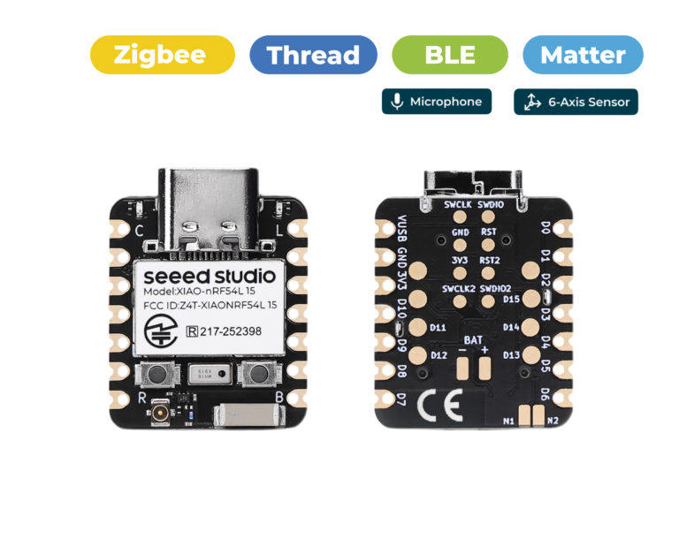
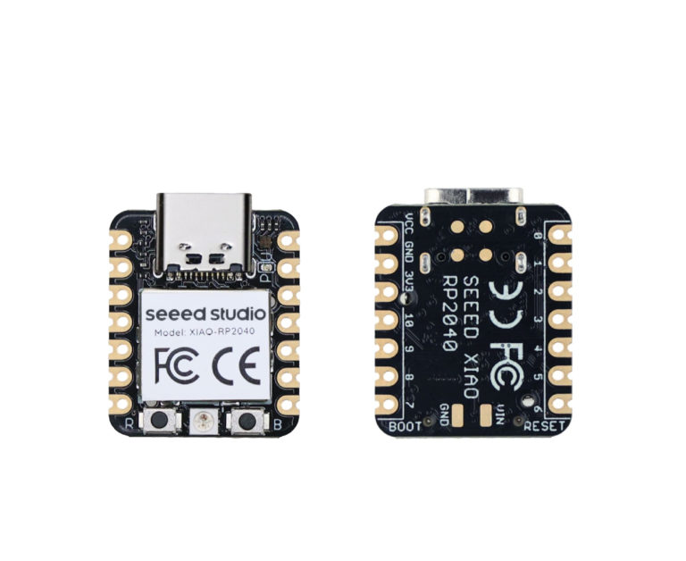
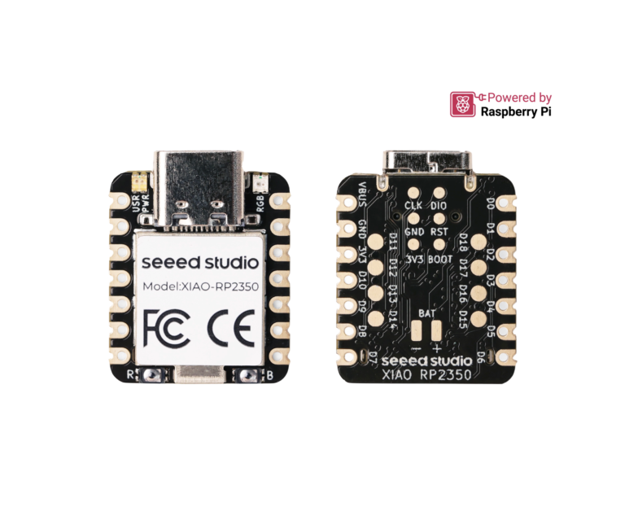
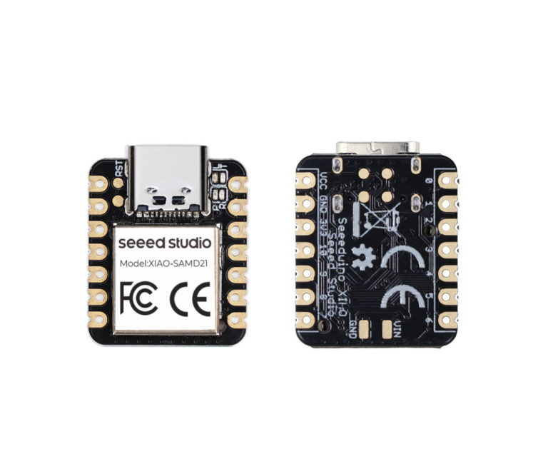
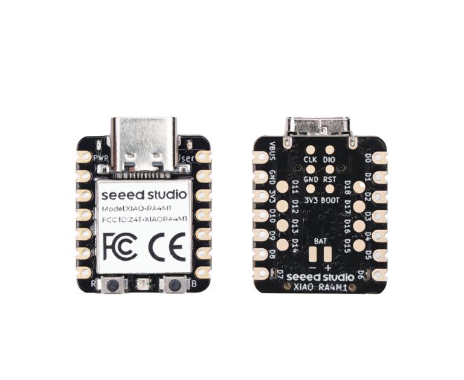
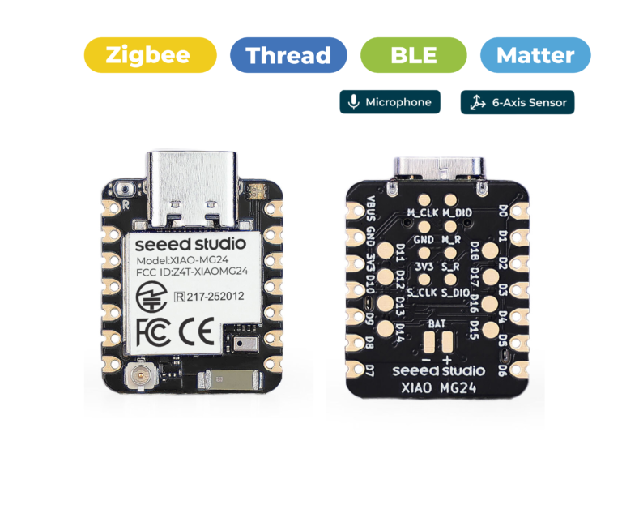

# [Seeed Studio XIAO Series](https://www.seeedstudio.com/xiao-series-page?utm_source=github&utm_medium=seeed&utm_campaign=xiaoseries)

## Product Family Overview
<p align="center" width="100%"><a href="https://github.com/Seeed-Studio/OSHW-XIAO-Series/blob/main/document/Seeed_Studio_XIAO_Slides.pdf">

</a>
</p>


The Seeed Studio XIAO Series is a collection of thumb-sized, powerful microcontroller units (MCUs) tailor-made for space-conscious projects requiring high performance and wireless connectivity. Embodying the essence of popular hardware platforms such as ESP32, Raspberry Pi, Nordic and SAMD21, the Arduino-compatible XIAO series is the perfect toolset for you to embrace tiny machine learning (TinyML) on the Edge. The whole XIAO Series features compact design with all SMD components placed on the same side of the board, so designers can easily integrate XIAO into their boards for rapid mass production.

This repository is the official GitHub Project Hub for the XIAO Series, serving as an aggregated entry point for selection guidance, technical documentation, internal reference projects, and community-driven DIY works.

**Contents**

[Product Lineup and Selection Guide](#product-lineup-and-selection-guide)

- [XIAO Dev Boards](#xiao-dev-boards)
- [XIAO Add-on](#xiao-add-ons)
- [XIAO Gadgets](#xiao-gadgets)

[Wiki and Learning](#wiki-and-learning)

[Reference Projects](#reference-projects)

[Community DIY Projects](#community-diy-projects)

- [XIAO USE CASE](#xiao-use-case)
- [Share Your Projects](#share-your-projects)
<!-- - [Make Profit From Your Ideas with Co-Create](#make-profit-from-your-ideas-with-co-create) -->

[Roadmap](#roadmap)

[Follow us](#follow-us)

---

## Product Lineup and Selection Guide

### XIAO Dev Boards

<table align="center">
<font size={"2"}>
	<tr>
	    <td align="center"></td>
		<td><strong>XIAO ESP32-S3 (Sense)</strong><br>High-performance dev board with Wi-Fi and BLE, with Microphone, Mini camera and onboard SD Card Slot on the Sense version</td>
        <td align="center" width= "200">
		<a href="https://www.seeedstudio.com/XIAO-ESP32S3-p-5627.html" target="_blank"><b><strong>🖱️ Buy</strong></b></a>
		<a href="https://www.seeedstudio.com/XIAO-ESP32S3-Sense-p-5639.html" target="_blank"><b><strong>🖱️ Buy(Sense)</strong></b></a><br>
		<a href="https://wiki.seeedstudio.com/xiao_esp32s3_getting_started/" target="_blank"><b><strong>📚 Wiki</strong></b></a>
		<a href="https://wiki.seeedstudio.com/xiao_esp32s3_getting_started/#resources" target="_blank"><b><strong>📚 Resources</strong></b></a></td>
	</tr>
	<tr>
	    <td align="center"></td>
		<td><strong>XIAO ESP32-C3</strong><br>Cost effective with Wi-Fi and BLE on board</td>
        <td align="center"><a href="https://www.seeedstudio.com/Seeed-XIAO-ESP32C3-p-5431.html" target="_blank"><b><strong>🖱️ Buy</strong></b></a><br>
		<a href="https://wiki.seeedstudio.com/XIAO_ESP32C3_Getting_Started/" target="_blank"><b><strong>📚 Wiki</strong></b></a>
		<a href="https://wiki.seeedstudio.com/XIAO_ESP32C3_Getting_Started/#resources" target="_blank"><b><strong>📚 Resources</strong></b></a></td>
	</tr>
	<tr>
	    <td align="center"></td>
		<td><strong>XIAO ESP32-C6</strong><br>2.4GHz Wi-Fi 6, BLE 5.0, Zigbee, and Thread for Matter</td>
        <td align="center"><a href="https://www.seeedstudio.com/Seeed-Studio-XIAO-ESP32C6-p-5884.html" target="_blank"><b><strong>🖱️ Buy</strong></b></a><br>
		<a href="https://wiki.seeedstudio.com/xiao_esp32c6_getting_started/" target="_blank"><b><strong>📚 Wiki</strong></b></a>
		<a href="https://wiki.seeedstudio.com/xiao_esp32c6_getting_started/#resources" target="_blank"><b><strong>📚 Resources</strong></b></a></td>
	</tr>
	<tr>
	    <td align="center"></td>
		<td><strong>XIAO ESP32-C5</strong><br>2.4 & 5 GHz Wi-Fi 6, BLE 5.0, Zigbee, and Thread for Matter</td>
        <td align="center"><a href="https://www.seeedstudio.com/Seeed-Studio-XIAO-ESP32C5-p-6609.html" target="_blank"><b><strong>🖱️ Buy</strong></b></a><br>
		<a href="https://wiki.seeedstudio.com/xiao_esp32c5_getting_started/" target="_blank"><b><strong>📚 Wiki</strong></b></a>
		<a href="https://wiki.seeedstudio.com/xiao_esp32c5_getting_started/#resources" target="_blank"><b><strong>📚 Resources</strong></b></a></td>
	</tr>
	<tr>
	    <td align="center"></td>
		<td><strong>XIAO nRF52840 (Sense)</strong><br>Ultra-low power consumption, perfect for BLE applications, with microphone and 6-axis IMU on the Sense version</td>
        <td align="center">
		<a href="https://www.seeedstudio.com/Seeed-XIAO-BLE-nRF52840-p-5201.html" target="_blank"><b><strong>🖱️ Buy</strong></b></a>
		<a href="https://www.seeedstudio.com/Seeed-XIAO-BLE-Sense-nRF52840-p-5253.html" target="_blank"><b><strong>🖱️ Buy(Sense)</strong></b></a><br>
		<a href="https://wiki.seeedstudio.com/XIAO_BLE/" target="_blank"><b><strong>📚 Wiki</strong></b></a>
		<a href="https://wiki.seeedstudio.com/XIAO_BLE/#resources" target="_blank"><b><strong>📚 Resources</strong></b></a></td>
	</tr>
	<tr>
	    <td align="center"></td>
		<td><strong>XIAO nRF54L15 (Sense)</strong><br>Ultra low power consumption with multiple connectivity, with microphone and 6-axis IMU on the Sense version</td>
        <td align="center">
		<a href="https://www.seeedstudio.com/Seeed-XIAO-BLE-nRF52840-p-5201.html" target="_blank"><b><strong>🖱️ Buy</strong></b></a>
		<a href="https://www.seeedstudio.com/XIAO-nRF54L15-Sense-p-6494.html" target="_blank"><b><strong>🖱️ Buy(Sense)</strong></b></a><br>
		<a href="https://wiki.seeedstudio.com/xiao_nrf54l15_sense_getting_started/" target="_blank"><b><strong>📚 Wiki</strong></b></a>
		<a href="https://wiki.seeedstudio.com/xiao_nrf54l15_sense_getting_started/#resources" target="_blank"><b><strong>📚 Resources</strong></b></a></td>
	</tr>
	<tr>
	    <td align="center"></td>
		<td><strong>XIAO RP2040</strong><br>Raspberry Pi Ecosystem with great MicroPython support</td>
        <td align="center"><a href="https://www.seeedstudio.com/XIAO-RP2040-v1-0-p-5026.html" target="_blank"><b><strong>🖱️ Buy</strong></b></a><br>
		<a href="https://wiki.seeedstudio.com/XIAO-RP2040/" target="_blank"><b><strong>📚 Wiki</strong></b></a>
		<a href="https://wiki.seeedstudio.com/XIAO-RP2040/#resources" target="_blank"><b><strong>📚 Resources</strong></b></a></td>
	</tr>
	<tr>
	    <td align="center"></td>
		<td><strong>XIAO RP2350</strong><br>MicroPython-ready based on Raspberry Pi RP2350</td>
        <td align="center"><a href="https://www.seeedstudio.com/Seeed-XIAO-RP2350-p-5944.html" target="_blank"><b><strong>🖱️ Buy</strong></b></a><br>
		<a href="https://wiki.seeedstudio.com/getting-started-xiao-rp2350/" target="_blank"><b><strong>📚 Wiki</strong></b></a>
		<a href="https://wiki.seeedstudio.com/getting-started-xiao-rp2350/#resources" target="_blank"><b><strong>📚 Resources</strong></b></a></td>
	</tr>
	<tr>
	    <td align="center"></td>
		<td><strong>XIAO SAMD21</strong><br>Classic for Arduino beginners, with courses</td>
        <td align="center"><a href="https://www.seeedstudio.com/Seeeduino-XIAO-Arduino-Microcontroller-SAMD21-Cortex-M0+-p-4426.html" target="_blank"><b><strong>🖱️ Buy</strong></b></a><br>
		<a href="https://wiki.seeedstudio.com/Seeeduino-XIAO/" target="_blank"><b><strong>📚 Wiki</strong></b></a>
		<a href="https://wiki.seeedstudio.com/Seeeduino-XIAO/#resources" target="_blank"><b><strong>📚 Resources</strong></b></a></td>
	</tr>
	<tr>
	    <td align="center"></td>
		<td><strong>XIAO RA4M1</strong><br>Renesas 32-bit ARM Cortex-M4 MCU, Arduino IDE-ready</td>
        <td align="center"><a href="https://www.seeedstudio.com/Seeed-XIAO-RA4M1-p-5943.html" target="_blank"><b><strong>🖱️ Buy</strong></b></a><br>
		<a href="https://wiki.seeedstudio.com/getting_started_xiao_ra4m1/" target="_blank"><b><strong>📚 Wiki</strong></b></a>
		<a href="https://wiki.seeedstudio.com/getting_started_xiao_ra4m1/#resources" target="_blank"><b><strong>📚 Resources</strong></b></a></td>
	</tr>
	<tr>
	    <td align="center"></td>
		<td><strong>XIAO MG24 (Sense)</strong><br>Super-low power for battery-powered Matter projects, with microphone and 6-axis IMU on the Sense version</td>
        <td align="center">
		<a href="http://seeedstudio.com/Seeed-Studio-XIAO-MG24-p-6247.html" target="_blank"><b><strong>🖱️ Buy</strong></b></a>
		<a href="https://www.seeedstudio.com/Seeed-XIAO-MG24-Sense-p-6248.html" target="_blank"><b><strong>🖱️ Buy(Sense)</strong></b></a><br>
		<a href="https://wiki.seeedstudio.com/xiao_mg24_getting_started" target="_blank"><b><strong>📚 Wiki</strong></b></a>
		<a href="https://wiki.seeedstudio.com/xiao_mg24_getting_started/#resources" target="_blank"><b><strong>📚 Resources</strong></b></a></td>
	</tr>
</font>
</table>

💡 Seeed Studio XIAO Boards are also available in various versions of [**Pre-soldered**, **3pcs Pack**, **Plus**, and **Tape and Reel**](https://www.seeedstudio.com/xiao-series-page#boards).

💡 For more model comparisons: Please refer to the complete [Seeed Studio XIAO Series Comparison Table](https://wiki.seeedstudio.com/SeeedStudio_XIAO_Series_Introduction/#seeed-studio-xiao-series-comparison-table) for detailed RAM, Flash, and pin specifications, you can also find the resource files for each XIAO in the Open Source the Seeed Studio XIAO section on this page:
- Datasheets
- Schematic
- PCB design files
- PCB package libraries (including symbols)
- Pinout sheet
- 2D dimensional drawings
- 3D models
- Factory firmware

💡 Alternatively, you can refer to this comprehensive guide—arguably the most detailed selection guide in XIAO's history—*[Meet the Seeed Studio XIAO Family](https://dronebotworkshop.com/seeeduino-xiao-family/)*, with special thanks to [DroneBot Workshop](https://dronebotworkshop.com/) for their contribution.

### XIAO Add-ons

<p align="center" width="100%"><a href="https://www.seeedstudio.com/xiao-series-page#addon"></a></p>

The [XIAO Add-on](https://www.seeedstudio.com/xiao-series-page#addon) are expansion modules and "hats" designed to enhance the functionality of XIAO dev boards. They cover a variety of applications including display, control, and sensing, and allow for quick prototyping without complex wiring.

### XIAO Gadgets

<p align="center" width="100%"><a href="https://www.seeedstudio.com/xiao-series-page#gadget"></a></p>

[XIAO Gadget](https://www.seeedstudio.com/xiao-series-page#gadget) is compact, application-ready hardware built with XIAO dev boards. By combining XIAO with sensors, displays, connectivity, and enclosure-friendly modules, XIAO Gadgets help makers and developers rapidly turn ideas into functional, real-world devices without complex custom hardware design.  

---
## Wiki and Learning

<p align="center" width="100%"><a href="https://wiki.seeedstudio.com/xiao_topic_page/"></a></p>

Our team together with the community, has create a rich collection of wikis, applications and documentation. The [Seeed Studio XIAO EXHIBITION](https://wiki.seeedstudio.com/xiao_topic_page/) page is organized as a centralized index to help developers quickly locate detailed tutorials, reference materials, and ecosystem support links for each XIAO development board.
The page covers a wide range of topics, including:
- Product Guides
- Multiple programming languages and platforms
- Real-time operating systems (RTOS)
- Communication protocols
- TinyML and AI platforms
- Smart home solutions
- Open-source keyboard firmware support
- Other popular applications
- Prototyping tools (PCB Layout & Stimulation)
- IoT Clouds and IoT Platforms

>If you are a beginner, we recommend starting with the **Product Guides** section to learn the fundamentals of XIAO hardware and basic protocol usage. From there, you can gradually move on to communication features and RTOS fundamentals, and finally explore advanced topics such as TinyML and AI, open-source keyboard firmware, and complete IoT system integration.

---

## Reference Projects

<p align="center" width="100%"></p>

These projects are hands-on reproductions and validations of popular industry trends and real-world use cases, created by our internal engineers and shared in this repository’s `projects` folder. For each project, we include clear and practical step-by-step instructions in the project’s `README.md` file, so you can easily follow along and try it yourself. The projects currently available include:

- [XIAO_ESP32-C3_BLE_ESPresense](projects/reference-projects/XIAO_ESP32-C3_BLE_ESPresense)
- [XIAO_ESP32_CSI_Espectre](projects/reference-projects/XIAO_ESP32_CSI_Espectre)
- [More coming soon…](projects/reference-projects)

---

## Community DIY Projects

Welcome to the Community DIY Projects! This section is dedicated to collecting, sharing, and celebrating DIY projects from makers around the world. Our goal is to create a collaborative hub where beginners and experienced developers alike can explore real-world applications, learn from each other, and contribute their own creative solutions.

### XIAO USE CASE

<p align="center" width="100%"><a href="https://github.com/Seeed-Studio/OSHW-XIAO-Series/blob/main/projects/community-diy-project/XIAO_USE_CASE.pdf">

</a>
</p>

We have curated over a hundred high-quality community projects in [XIAO USE CASES](projects/community-diy-projects/XIAO_USE_CASE.pdf), where you can explore projects related to:  
- Wearables  
- Robotics  
- Smart Home  
- Health Care  
- Power Management  
- AI Gadgets  
- Tools & Accessories  
- Telecommunication  
- Mechanical Keyboards  
- LED Lighting  

We want to thank the community for inspiring these projects—your ideas, experiments, and feedback are what make this space vibrant and evolving. Every project here reflects the spirit of open collaboration and hands-on learning.

### Share Your Projects

Thank you for your interest in sharing your projects! Community projects help others learn faster, explore new use cases, and push the ecosystem forward. If you’ve built something interesting, useful, or fun — we’d love to feature it here 🚀

Your project can be submitted if it meets one or more of the following:
- A DIY project built with any XIAO Dev Boards.
- A proof-of-concept, prototype, or side project
- An application demo, experiment, or creative build
- A project originally published on GitHub, Hackster, Instructables, or a personal blog

Both `hardware-focused` and `software-focused` projects are welcome, and you can submit your project by:

1. Fork this repository

2. Create a new file under the `projects/community-diy-projects/ directory`. File name format:
	```
	XIAO_<ChipPlatform>_<KeyTech>_<ProjectName>
	# KeyTech: hardware, software, or protocol, or framework…
	```

3. Use the **Community Project Template** below to describe your project

4. Submit a **Pull Request**

5. Our maintainers will review and merge it

>**Community DIY Project Template**
>
> Please include the following information when submitting your project:
> 
> - Source Code
> - Examples
> - Project photos or screenshots (Optional but encouraged)
> - README.md file that accurately describes the project
> 
> 	```
> 	# Project Name
> 
> 	## Creator
> 	- Name / GitHub handle:
> 	- (Optional) Website or social link:
> 
> 	## Project Description
> 	A short description of what the project does and what problem it solves.
> 
> 	## Key Features
> 	- Feature 1
> 	- Feature 2
> 	- Feature 3
> 
> 	## Hardware & Software
> 	- Hardware components:
> 	- Software / frameworks:
> 	- Programming language:
> 
> 	## Quick Start
> 	- Demo video / blog post / Hackster page:
> 	- Getting Started
> 
> 	```

<!-- ### Make Profit From Your Ideas with Co-Create

If your project goes beyond a prototype and you’re interested in turning it into a commercial product, we invite you to explore [Seeed Studio’s Co-Create](https://www.seeedstudio.com/co-create.html). Through this program, participants can access a range of Seeed’s resources to help launch their products successfully. By partnering with Seeed Studio and licensing your idea, creators can focus on their vision while Seeed will manage all aspects of manufacturing, marketing, order processing, and distribution. **This collaboration allows you to earn royalties on every product sold**. -->

---

## Roadmap

<p align="center" width="100%"><a href="https://github.com/Seeed-Studio/OSHW-XIAO-Series/discussions">

</a>
</p>

We’re using this Discussion as a platform to connect with and get valuable feedback from the vibrant community of all XIAO owners. Here we'll share our dev roadmap proposals for the beloved XIAO (new features, new functions, new products for both XIAO boards and their accessories). And at the same time, we're inviting you to join to co-create the whole process: [**Roadmap of Seeed XIAO: You Decide What We Build Next!**](https://github.com/Seeed-Studio/OSHW-XIAO-Series/discussions)

---

## Follow us

- [Seeed Studio Reddit](https://www.reddit.com/r/Seeed_Studio/)
- [Seeed Studio Discord](https://discord.com/invite/QqMgVwHT3X)
- [Seeed Studio Forums](https://forum.seeedstudio.com/)
- [Seeed Studio Hackster](https://www.hackster.io/seeed)
- [Seeed Studio LinkedIn](https://www.linkedin.com/company/1475165/admin/dashboard/)
- [Seeed Studio X/Twitter](https://x.com/seeedstudio)
- [Seeed Studio Facebook](https://www.facebook.com/seeedstudiosz/)
- [Seeed Studio Youtube](https://www.youtube.com/c/SeeedStudioSZ-)
- [Seeed Studio Instagram](https://www.instagram.com/seeedstudio/)


